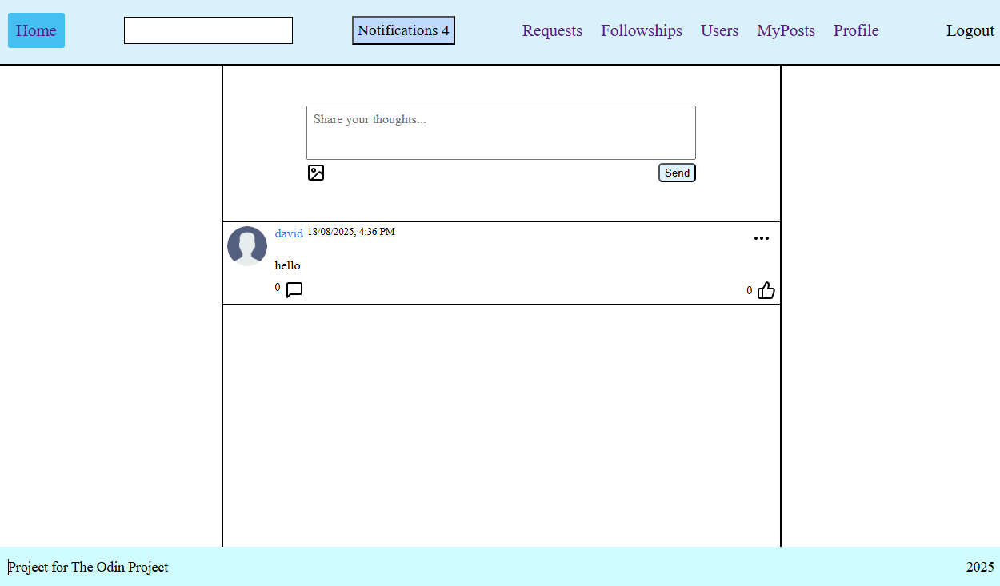

## Odin Book

Odin Book is a project for [The Odin Project](https://www.theodinproject.com/lessons/node-path-nodejs-odin-book) built with Express and React. Odin Book with live feed and updates with notifications on new posts and requests. Post your thoughts, comment and like other user's posts and comments.  

Icons from https://www.flaticon.com  
frontend https://github.com/John-Rashta/odin-odin-book-frontend      
App deployed [here](https://odin-odin-book-frontend-production.up.railway.app/)

## Features
- **Authentication**
- **Live Feed**
- **Posts and comments**
- **Follows and Followings**

## TechStack

**Backend**:  
- **Node.js (TypeScript)**
- **Express**
- **Prisma**
- **PostgreSQL**  
- **Socket.IO**

**Frontend**:
- **React**
- **Vite**
- **React Router**
- **Redux + RTK Query**
- **Socket.IO**

**Deployment**:
- **Railway**
  